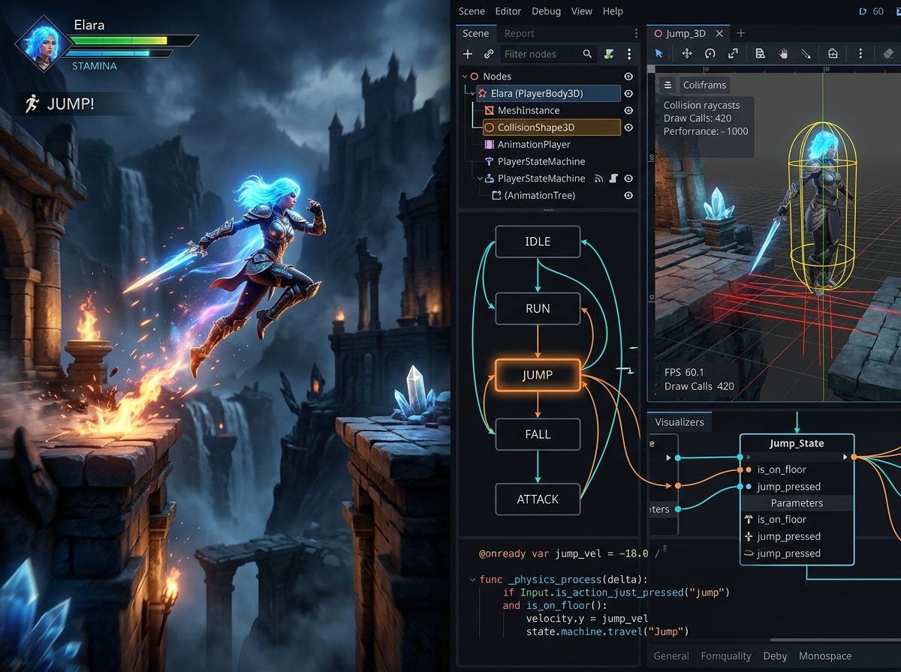

# Godot 4.x Development Skill & Knowledge Base 🚀

A comprehensive, production-grade Godot Engine 4.x development skill and reference manual tailored for AI coding agents (Claude Code, Antigravity IDE, Cursor, Hermes Agent, GPT) and human developers.

<p align="center">
  
</p>

---

## 🎯 Overview

This repository provides structured guidelines, GDScript 2.0 idiom patterns, and modular reference sheets designed to give AI agents deep context on Godot 4.x game development without hallucinations or legacy Godot 3.x patterns.

### 🌟 Key Highlights

- **Typed GDScript 2.0**: Static typing, annotations (`@export`, `@onready`, `@rpc`), Callables, and Lambdas.
- **Node & Scene Architecture**: Composition over inheritance, lifecycle management, and "Call Down, Signal Up" design.
- **2D/3D Physics**: Modern `CharacterBody2D` / `CharacterBody3D` controllers, raycasting, and collision layers.
- **Modular UI & Containers**: Responsive layouts, anchor presets, themes, and controller/keyboard focus navigation.
- **Animation & State Machines**: `AnimationPlayer`, `AnimationTree` (StateMachine/BlendTree), and procedural `Tween` animations.
- **Audio & Buses**: Sound buses, `AudioStreamRandomizer`, and audio pooling.
- **Shaders**: 2D (`canvas_item`) and 3D (`spatial`) shaders, screen reading, and custom uniform effects.
- **High-Level Multiplayer**: RPC annotations, scene replication, multiplayer spawners/synchronizers, and HTTP APIs.
- **Godot MCP Integration**: Ready for Model Context Protocol servers (`tugcantopaloglu/godot-mcp`, `IvanMurzak/Godot-MCP`).

---

## 📂 Repository Structure

```
├── SKILL.md                 # Main router and operational manual for AI agents
├── MANIFEST.md              # Bundle manifest and MCP compatibility specification
├── LICENSE                  # MIT License
└── references/              # Detailed on-demand topic guides
    ├── gdscript-4.x.md      # GDScript 2.0 best practices and modern syntax
    ├── scenes-and-nodes.md  # SceneTree, node hierarchy, and event buses
    ├── physics-2d-3d.md     # 2D & 3D character movement and physics
    ├── ui.md                # Responsive UI, controls, and focus handling
    ├── animation.md         # AnimationTree, state machines, and tweens
    ├── audio.md             # Sound effects, buses, and randomizers
    ├── shaders.md           # Visual shaders and GLSL in Godot 4
    ├── networking.md        # High-level multiplayer, RPCs, and networking
    └── godot-mcp-tools.md   # MCP tools discovery and autonomous operations
```

---

## 🤖 How to Use with AI Agents

### Antigravity IDE / Claude Code / Hermes Agent / Cursor
Point your agent to load `SKILL.md` as its system context or skill definition when working on Godot 4 projects. The skill dynamically routes to specific files in `references/` as needed to save token budget while maintaining high accuracy.

---

## 📄 License

Distributed under the [MIT License](LICENSE).
