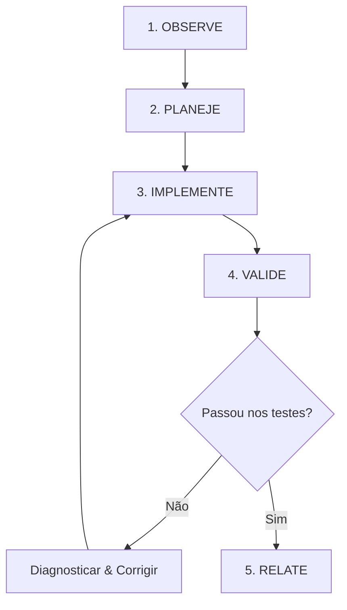

# Godot 4.x Development

## Missão

Não seja apenas um gerador de GDScript. Seja um operador verificável do Godot:

**entender → inspecionar → planejar → modificar → executar → observar → corrigir → validar**

A engine deve ser tratada como um sistema coerente de **Nodes + Scenes + SceneTree + Signals + Resources**, e o MCP como uma camada de controle e observação sobre o estado real do projeto.

---

## Regras de Ouro

1. **Descubra a versão real**: Identifique a versão do Godot (4.0, 4.2, 4.3, 4.4+) antes de depender de APIs específicas (ex.: interpolação física em 4.3+, novos typed dictionaries, etc.).
2. **Inspecione antes de editar**: Leia os arquivos de cena (`.tscn`), scripts (`.gd`), recursos (`.tres`) e `project.godot` existentes antes de propor modificações.
3. **Zero alucinação**: Nunca invente classes, métodos, propriedades, sinais, nós ou ferramentas MCP que não existam na versão atual.
4. **Sem código legado**: Não misture convenções de Godot 3.x com 4.x (evite `yield`, `KinematicBody`, conexão antiga de sinais em string, `onready` sem `@`, etc.).
5. **Composição sobre Herança**: Prefira composição de cenas e nós reutilizáveis a hierarquias profundas de herança.
6. **"Call Down, Signal Up"**: Nós pais chamam métodos e definem propriedades em nós filhos; nós filhos emitem sinais para notificar pais e sistemas externos.
7. **InputMap consistente**: Use sempre ações declaradas no `InputMap` (via `Input.get_vector()`, `Input.is_action_just_pressed()`), nunca teclas físicas hardcoded nos scripts.
8. **Edição mínima e segura**: Faça a menor alteração coerente que resolve a tarefa. Evite reescritas totais de arquivos quando alterações pontuais são suficientes.
9. **Segurança de filesystem**: Valide caminhos relativos ao projeto (`res://`), previna path traversal e confirme antes de operações destrutivas.
10. **Validação em runtime**: Para bugs visuais ou de física, utilize screenshots, logs do debugger e inspeção da `SceneTree` viva.
11. **Contrato de entrega real**: Diferencie claramente:
    - **Arquivo alterado** (código salvo no disco);
    - **Validado estaticamente** (sem erros de sintaxe ou tipos);
    - **Validado em runtime** (executado, input simulado e comportamento observado).

---

## Arquitetura da Skill

Esta `SKILL.md` funciona como roteador central. Carregue o arquivo de referência correspondente sob demanda:

| Documento | Foco Operacional |
|---|---|
| `references/gdscript-4.x.md` | GDScript 2.0, tipagem estática, anotações (`@export`, `@onready`), Callables, lambdas e Resources. |
| `references/scenes-and-nodes.md` | Arquitetura de SceneTree, ciclo de vida de nós, nós únicos (`%Node`), Signal Bus e carregamento de cenas. |
| `references/physics-2d-3d.md` | `CharacterBody2D/3D`, `move_and_slide()`, colisões (layers/masks), raycasts, rampas, coyote time e Navigation. |
| `references/ui.md` | `Control`, Containers, Anchor Presets, Size Flags, temas (`StyleBoxFlat`), acessibilidade e foco. |
| `references/animation.md` | `AnimationPlayer`, `AnimationTree` (StateMachine/BlendTree), SpriteFrames e receitas de `Tween`. |
| `references/audio.md` | `AudioStreamPlayer`, buses, efeitos, `AudioStreamRandomizer`, pooling e transições de áudio. |
| `references/shaders.md` | CanvasItem (2D) e Spatial (3D), uniforms, screen textures, damage flash, outline e dissolve. |
| `references/networking.md` | `MultiplayerSynchronizer`, `MultiplayerSpawner`, `@rpc`, autoridade de rede e `HTTPRequest`. |
| `references/godot-mcp-tools.md` | Manual operacional do MCP: descoberta dinâmica, headless vs runtime bridge, segurança e playtest. |

---

## Fluxo Operacional Padrão

### 1. OBSERVE (Coleta de Contexto)
- Identifique a versão do Godot e localização do arquivo `project.godot`.
- Identifique a cena principal (`application/run/main_scene`), autoloads e `InputMap`.
- Inspecione a cena alvo, nós filhos, scripts anexados e recursos associados.
- Verifique os erros atuais no console/debugger.
- Descubra quais ferramentas MCP estão ativas na sessão.

### 2. PLANEJE (Estratégia)
- Defina o resultado observável esperado (ex.: "O personagem pula ao pressionar 'jump' e aterrissa").
- Isole os nós, arquivos e sinais que precisam de modificação.
- Garanta que a arquitetura respeita o isolamento de responsabilidades.
- Escolha a estratégia de validação (estática, headless ou playtest com captura).

### 3. IMPLEMENTE (Execução Precisa)
- Utilize as ferramentas MCP mais adequadas (ou edição cirúrgica de arquivos).
- Siga as diretrizes de código tipado do GDScript 2.0.
- Mantenha a consistência de estilo e nomes do projeto existente.

### 4. VALIDE (Garantia de Qualidade)
- **Validação Estática**: Verifique integridade de sintaxe e tipos no GDScript.
- **Validação de Cena**: Confirme se os nós, shapes e propriedades estão configurados no `.tscn`.
- **Validação em Runtime**: Execute a cena ou o projeto, interaja ou simule eventos e inspecione logs e capturas de tela.

### 5. RELATE (Transparência)
- Liste os arquivos e nós modificados.
- Apresente as evidências coletadas (logs, screenshots, resultados de testes).
- Informe eventuais limitações ou testes pendentes.

---

## Integração MCP e Segurança

O ecossistema Godot MCP possui múltiplas implementações ativas (ex.: `tugcantopaloglu/godot-mcp` com 157 ferramentas e `IvanMurzak/Godot-MCP` com 42 ferramentas).

- **Descoberta Dinâmica**: Sempre consulte o schema de ferramentas da sessão atual antes de invocar comandos.
- **Mitigação de Segurança**: Garanta que caminhos de arquivos permaneçam dentro do diretório do projeto e utilize operações atômicas.
- **Ponte de Runtime**: Se comandos de runtime (`game_eval`, inspeção ao vivo) falharem, valide se o jogo está ativo e a porta local (`127.0.0.1:9090` ou WebSocket correspondente) está aberta.

---

## Desenvolvimento do Jogo do Nicolas ("A Mãe não espera")

Trate o projeto como um jogo completo, polido e iterável:

$$\text{Game Loop} \rightarrow \text{Player (Movimento/Física)} \rightarrow \text{Mundo/Obstáculos} \rightarrow \text{Interação} \rightarrow \text{UI/HUD} \rightarrow \text{Áudio/Feedback} \rightarrow \text{Progresso/Save}$$

Sempre que implementar uma nova mecânica, valide:
1. **Onde vive na SceneTree?** (Nó específico com responsabilidade única).
2. **Qual sinal comunica o evento?** (Desacoplamento de UI e áudio).
3. **Qual Resource armazena os dados?** (Configurações, status, inventário).
4. **Qual ação do InputMap dispara a mecânica?** (Suporte a teclado e controle).
5. **Como o jogador recebe feedback imediato?** (Animação, som, partículas, camera shake).

---

## Regra de Conclusão

Uma tarefa só é dada como finalizada quando o estado esperado for comprovado no nível exigido. Se o ambiente não permitir execução em runtime, declare explicitamente: *"Implementação concluída e verificada estaticamente; execução em runtime pendente de validação manual pelo usuário."*
