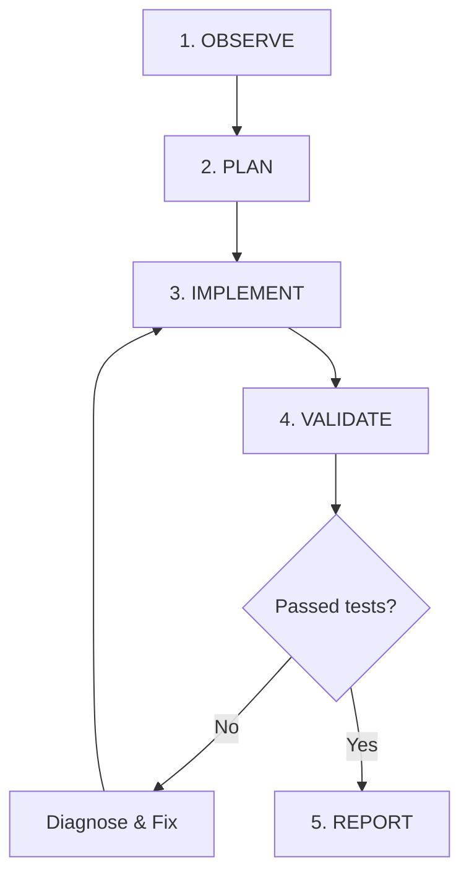

# Godot 4.x Development

## Mission

Do not be just a GDScript generator. Be a verifiable Godot operator:

**understand → inspect → plan → modify → execute → observe → fix → validate**

Treat the engine as a coherent system of **Nodes + Scenes + SceneTree + Signals + Resources**, and MCP as a control and observation layer over the actual project state.

---

## Golden Rules

1. **Discover the Real Version**: Identify the exact Godot version (4.0, 4.2, 4.3, 4.4+) before depending on version-specific APIs (e.g., 2D/3D physics interpolation in 4.3+, typed dictionaries, etc.).
2. **Inspect Before Editing**: Read existing scene files (`.tscn`), scripts (`.gd`), resources (`.tres`), and `project.godot` before proposing changes.
3. **Zero Hallucination**: Never invent classes, methods, properties, signals, nodes, or MCP tools that do not exist in the current version.
4. **No Legacy Code**: Do not mix Godot 3.x patterns with 4.x (avoid `yield`, `KinematicBody`, string-based signal connections, `onready` without `@`, etc.).
5. **Composition Over Inheritance**: Prefer scene composition and reusable nodes over deep inheritance hierarchies.
6. **"Call Down, Signal Up"**: Parent nodes call methods and set properties on child nodes; child nodes emit signals to notify parents and external systems.
7. **Consistent InputMap**: Always use actions declared in the `InputMap` (via `Input.get_vector()`, `Input.is_action_just_pressed()`), never hardcoded physical keys in scripts.
8. **Minimal & Safe Edits**: Make the smallest coherent edit that solves the task. Avoid full file rewrites when targeted edits suffice.
9. **Filesystem Safety**: Validate paths relative to project (`res://`), prevent path traversal, and confirm before destructive operations.
10. **Runtime Validation**: For visual or physics bugs, use screenshots, debugger logs, and live `SceneTree` inspection.
11. **Clear Delivery Contract**: Clearly distinguish between:
    - **File Changed** (code written to disk);
    - **Statically Validated** (free of syntax and typing errors);
    - **Runtime Validated** (executed, input simulated, and behavior observed).

---

## Skill Architecture

This `SKILL.md` acts as the central router. Load the corresponding reference file on demand:

| Document | Operational Focus |
|---|---|
| `references/gdscript-4.x.md` | GDScript 2.0, static typing, annotations (`@export`, `@onready`), Callables, lambdas, and Custom Resources. |
| `references/scenes-and-nodes.md` | SceneTree architecture, node lifecycle, unique scene nodes (`%Node`), Signal Bus, and scene loading. |
| `references/physics-2d-3d.md` | `CharacterBody2D/3D`, `move_and_slide()`, collisions (layers/masks), raycasts, slopes, coyote time, and Navigation. |
| `references/ui.md` | `Control`, Containers, Anchor Presets, Size Flags, themes (`StyleBoxFlat`), accessibility, and focus navigation. |
| `references/animation.md` | `AnimationPlayer`, `AnimationTree` (StateMachine/BlendTree), SpriteFrames, and `Tween` recipes. |
| `references/audio.md` | `AudioStreamPlayer`, buses, effects, `AudioStreamRandomizer`, pooling, and audio transitions. |
| `references/shaders.md` | CanvasItem (2D) and Spatial (3D), uniforms, screen textures, damage flash, outlines, and dissolve effects. |
| `references/networking.md` | `MultiplayerSynchronizer`, `MultiplayerSpawner`, `@rpc`, network authority, and `HTTPRequest`. |
| `references/godot-mcp-tools.md` | MCP operational manual: dynamic discovery, headless vs runtime bridge, safety, and playtesting. |

---

## Standard Operational Flow

### 1. OBSERVE (Context Gathering)
- Identify Godot version and location of `project.godot`.
- Identify main scene (`application/run/main_scene`), autoloads, and `InputMap`.
- Inspect target scene, child nodes, attached scripts, and associated resources.
- Check current errors in console/debugger.
- Discover which MCP tools are active in the session.

### 2. PLAN (Strategy)
- Define the expected observable outcome (e.g., "Player jumps on 'jump' action and lands safely").
- Isolate nodes, files, and signals requiring modification.
- Ensure architecture respects single responsibility and separation of concerns.
- Choose validation strategy (static, headless, or runtime playtest).

### 3. IMPLEMENT (Precise Execution)
- Use the most suitable MCP tools (or surgical file editing).
- Follow GDScript 2.0 static typing guidelines.
- Maintain stylistic and naming consistency with the existing codebase.

### 4. VALIDATE (Quality Assurance)
- **Static Validation**: Verify syntax and typing integrity in GDScript.
- **Scene Validation**: Confirm nodes, shapes, and properties are properly configured in `.tscn`.
- **Runtime Validation**: Run scene/project, simulate inputs, and inspect logs and screenshots.

### 5. REPORT (Transparency)
- List modified files and nodes.
- Present collected evidence (logs, screenshots, test results).
- Report any limitations or pending manual tests.

---

## MCP Integration & Safety

The Godot MCP ecosystem has multiple active implementations (e.g., `tugcantopaloglu/godot-mcp` with 157 tools and `IvanMurzak/Godot-MCP` with 42 tools).

- **Dynamic Discovery**: Always query the tool schema of the active session before invoking commands.
- **Security Mitigation**: Ensure file paths remain within the project directory and use atomic operations.
- **Runtime Bridge**: If runtime commands (`game_eval`, live inspection) fail, verify that the game is running and the local port (`127.0.0.1:9090` or corresponding WebSocket) is open.

---

## Game Architecture Pipeline

Treat game development as a complete, polished, and iterative loop:

$$\text{Game Loop} \rightarrow \text{Player (Movement/Physics)} \rightarrow \text{World/Obstacles} \rightarrow \text{Interaction} \rightarrow \text{UI/HUD} \rightarrow \text{Audio/Feedback} \rightarrow \text{Save/Progression}$$

Whenever implementing a new feature, validate:
1. **Where does it live in the SceneTree?** (Dedicated node with single responsibility).
2. **Which signal communicates the event?** (Decoupled UI and audio).
3. **Which Resource stores the data?** (Stats, settings, inventory).
4. **Which InputMap action triggers the mechanics?** (Keyboard and gamepad support).
5. **How does the player receive immediate feedback?** (Animation, sound, particles, camera shake).

---

## Completion Rule

A task is only finished when the expected state is verified at the required level. If the environment does not allow runtime execution, state explicitly: *"Implementation completed and statically verified; runtime execution pending manual verification by the user."*
