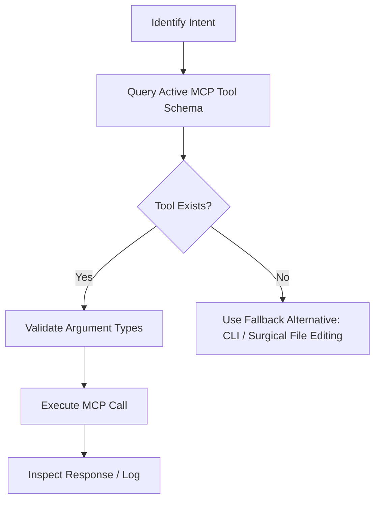

# Godot MCP — Operational Manual

## Purpose

This document guides AI agents in operating **Model Context Protocol (MCP)** servers connected to Godot Engine 4.x. It establishes protocols for interacting with headless tooling, editor control, runtime bridges, and evidence-based playtesting.

---

## Reference Sources & MCP Ecosystems

There are two primary implementations in the Godot 4 ecosystem:

1. **`tugcantopaloglu/godot-mcp`**:
   - ~157 tools covering headless project operations, scene/node/resource JSON manipulation, input injection, audio/physics/UI control, and runtime bridging via TCP (`127.0.0.1:9090` with `McpInteractionServer`).
   - Supports both GDScript and C#/.NET.
2. **`IvanMurzak/Godot-MCP` (Asset Library #5245)**:
   - 42 tools grouped into 12 functional families (Scene, Node, Script, Resource, Filesystem, Project, Screenshot, Debugger, etc.) as a C# editor plugin for Godot 4.3+.

> [!IMPORTANT]
> The active session's tool schema is the **single source of truth**. Never invoke tool names from memory without inspecting the schemas provided in the session.

---

## 1. Dynamic Tool Discovery Workflow



1. **Discover Available Tools:** Check exposed tool names and descriptions.
2. **Read Parameter Schemas:** Inspect expected types (e.g., paths like `res://`, vectors like `{"x": 100, "y": 200}`, or arrays of floats).
3. **Execute with Validated Arguments:** Prevent invocations with missing required fields.
4. **Handle Fallbacks Gracefully:** If a specific MCP tool is unavailable, fall back to CLI commands (`godot --headless`) or direct manipulation of `.tscn` and `.gd` files.

---

## 2. Functional Tool Categories

| Category | Typical Operations | Operation Mode |
|---|---|---|
| **Project** | Read/modify `project.godot`, list autoloads, configure `InputMap`, query version. | Headless / Static |
| **Filesystem** | Create/move/read files in `res://`, manage UIDs (`.uid`). | Static |
| **Scenes** | Create `.tscn` scenes, instantiate nodes, modify hierarchy, save changes. | Headless / Parser |
| **Nodes** | Add nodes, configure properties (`position`, `visible`, etc.), reparent, delete. | Headless or Runtime |
| **Scripts** | Create `.gd`, attach to nodes, validate syntax, inspect members and signals. | Static |
| **Resources** | Create/edit `.tres` (materials, `SpriteFrames`, `Theme`, `AudioStreamRandomizer`). | Headless |
| **Runtime Control** | Launch game (`run_project`), pause, stop, query live node tree. | Runtime Bridge |
| **Input Injection** | Simulate `InputMap` actions (`press_action`, `release_action`, `set_action_vector`). | Runtime Bridge |
| **Visual / Screenshot** | Capture running game window for UI/visual bug verification. | Runtime Bridge / OS |
| **Debug / Eval** | Evaluate GDScript snippets in live SceneTree (`game_eval`), read error console. | Runtime Bridge |

---

## 3. Headless vs. Runtime Bridge Operations

### Headless Mode (Authoring / Static)
Ideal for development tasks that do not require an active game window:
- Creating and editing `.gd` scripts and `.tscn` scenes.
- Setting up physics collision layer names (`layer_names/2d_physics/*`).
- Registering actions in `InputMap`.
- Running automated headless tests (`godot --headless --script res://test_suite.gd`).

### Runtime Bridge Mode (Running Game Process)
Required for diagnosing physics, interactions, animations, and dynamic UI:
- Connects the agent to the game process via local socket (e.g., TCP `127.0.0.1:9090` or WebSocket).
- Allows inspecting dynamically spawned nodes that do not exist in static scene files.
- Captures viewport screenshots at specific frames.

> [!NOTE]
> If a runtime call fails, verify that:
> 1. The game was launched and the window is active;
> 2. The MCP bridge node (autoload or plugin) initialized properly;
> 3. The local port is not blocked by a firewall or port conflict.

---

## 4. Security, File Integrity & Mitigations

- **Path Traversal Prevention:** Always use normalized relative paths prefixed with `res://` (e.g., `res://scenes/player.tscn`). Reject any path containing `../` that resolves outside the project root.
- **Atomic Modifications:** When editing textual `.tscn` or `project.godot` files, preserve unrelated existing sections.
- **Destructive Operations:** Never wipe entire directories or replace main scenes without verifying dependencies in child scenes.

---

## 5. Evidence-Based Playtesting (Step-by-Step)

To verify mechanics and bug fixes:

```text
1. Validate syntax of modified scripts.
2. Launch project (via MCP run_project or terminal).
3. Wait for main scene initialization.
4. Inject controlled input (e.g., hold "ui_right" for 500ms).
5. Query Player position and velocity in live SceneTree.
6. Capture screenshot to verify visual change.
7. Inspect debugger for warnings or runtime errors.
8. Terminate game process and summarize findings.
```

### Example: Character Jump Verification
- **Action:** Inject `"jump"` action.
- **Expected Evidence:** `player.velocity.y < 0` immediately after jump and `player.is_on_floor() == false`.
- **Evidence after 1 second:** `player.is_on_floor() == true` (safely landed) with no collision errors in logs.

---

## 6. Safe Runtime Evaluation (`game_eval`)

When `game_eval` (or equivalent) is enabled:
- Restrict usage to **queries and diagnostics**:
  ```gdscript
  # Safe read-only inspection
  return {
      "player_pos": get_tree().current_scene.get_node("Player").global_position,
      "is_on_floor": get_tree().current_scene.get_node("Player").is_on_floor(),
      "current_health": get_tree().current_scene.get_node("Player").health
  }
  ```
- Avoid executing permanent state mutations that mask core logic bugs.
- Never leave temporary eval hooks in production code.
