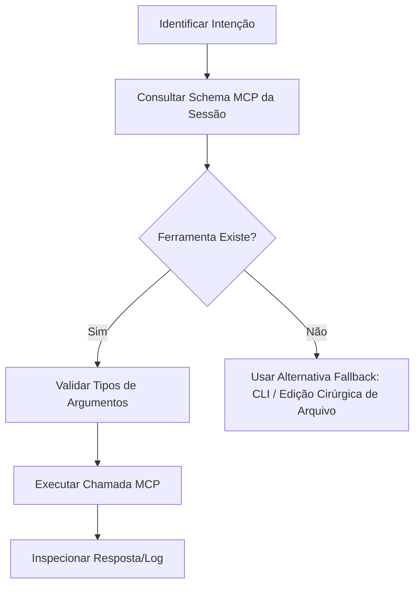

# Godot MCP — Manual Operacional do Hermes

## Propósito

Este documento orienta o agente na operação de servidores **Model Context Protocol (MCP)** acoplados à Godot Engine 4.x. Ele fornece diretrizes para interagir com ferramentas headless, gerenciar o editor, conectar-se à ponte de runtime e conduzir playtests baseados em evidências.

---

## Fontes de Referência e Ecossistemas MCP

Existem duas implementações principais no ecossistema Godot 4:

1. **`tugcantopaloglu/godot-mcp`**:
   - ~157 ferramentas abrangendo operações headless no projeto, manipulação de cenas/nós/recursos via JSON, injeção de input, controle de áudio/física/UI e ponte de runtime via TCP (`127.0.0.1:9090` com `McpInteractionServer`).
   - Suporte a GDScript e C#/.NET.
2. **`IvanMurzak/Godot-MCP` (Asset Library #5245)**:
   - 42 ferramentas integradas em 12 famílias (Scene, Node, Script, Resource, Filesystem, Project, Screenshot, Debugger, etc.) como plugin de editor em C# para Godot 4.3+.

> [!IMPORTANT]
> O schema de ferramentas fornecido pela sessão ativa é a **única fonte de verdade**. Nunca invoque nomes de ferramentas de memória sem antes consultar as ferramentas disponibilizadas na sessão.

---

## 1. Fluxo de Descoberta Dinâmica de Ferramentas



1. **Descubra as ferramentas disponíveis:** Verifique os nomes e descrições das ferramentas expostas.
2. **Leia o schema de parâmetros:** Inspecione tipos esperados (ex.: caminhos como `res://`, vetores como `{"x": 100, "y": 200}` ou arrays de floats).
3. **Execute com argumentos validados:** Previna chamadas com campos ausentes.
4. **Trate falhas com elegância:** Se a ferramenta MCP não estiver disponível, recorra a comandos de terminal (`godot --headless`) ou manipulação direta de arquivos `.tscn` e `.gd`.

---

## 2. Categorias Funcionais de Ferramentas

| Categoria | Operações Típicas | Modo de Operação |
|---|---|---|
| **Project** | Ler/alterar `project.godot`, listar autoloads, configurar `InputMap`, obter versão. | Headless / Estático |
| **Filesystem** | Criar/mover/ler arquivos em `res://`, gerenciar UIDs (`.uid`). | Estático |
| **Scenes** | Criar cenas `.tscn`, instanciar nós, alterar hierarquia, salvar alterações. | Headless / Parser |
| **Nodes** | Adicionar nós, configurar propriedades (`position`, `visible`, etc.), reparentar, deletar. | Headless ou Runtime |
| **Scripts** | Criar `.gd`, anexar a nós, validar sintaxe, inspecionar membros e sinais. | Estático |
| **Resources** | Criar/editar `.tres` (materiais, `SpriteFrames`, `Theme`, `AudioStreamRandomizer`). | Headless |
| **Runtime Control** | Iniciar jogo (`run_project`), pausar, parar, obter árvore de nós ao vivo. | Runtime Bridge |
| **Input Injection** | Simular ações do `InputMap` (`press_action`, `release_action`, `set_action_vector`). | Runtime Bridge |
| **Visual / Screenshot** | Capturar tela do jogo em execução para validação de bugs gráficos ou UI. | Runtime Bridge / OS |
| **Debug / Eval** | Executar snippets de GDScript na SceneTree viva (`game_eval`), ler console de erros. | Runtime Bridge |

---

## 3. Operações Headless vs. Runtime Bridge

### Modo Headless (Authoring / Estático)
Ideal para tarefas de desenvolvimento que não exigem a janela do jogo aberta:
- Criação e modificação de scripts `.gd` e cenas `.tscn`.
- Configuração de camadas de física (`layer_names/2d_physics/*`).
- Registro de ações no `InputMap`.
- Execução de testes automatizados ou compilação estática (`godot --headless --script res://test_suite.gd`).

### Modo Runtime Bridge (Jogo em Execução)
Necessário para diagnosticar física, interações, animações e interfaces dinâmicas:
- A ponte conecta o agente ao processo do jogo via socket local (ex.: TCP `127.0.0.1:9090` ou WebSocket).
- Permite inspecionar nós criados dinamicamente que não aparecem no arquivo de cena estático.
- Permite capturar screenshots do viewport do jogo em instantes específicos.

> [!NOTE]
> Se uma chamada de runtime falhar, verifique se:
> 1. O jogo foi iniciado e a janela está ativa;
> 2. O nó da ponte MCP (autoload ou plugin) foi devidamente inicializado;
> 3. A porta local não está bloqueada por firewall ou em conflito.

---

## 4. Segurança, Integridade de Arquivos e Mitigações

- **Prevenção de Path Traversal (CVE-2026-15522):** Sempre use caminhos relativos normalizados com o prefixo `res://` (ex.: `res://scenes/player.tscn`). Rejeite caminhos que contenham `../` que apontem para fora do diretório do projeto.
- **Edições Atômicas:** Sempre que modificar arquivos `.tscn` textuais ou `project.godot`, preserve seções existentes não relacionadas.
- **Confirmação em Operações Destrutivas:** Nunca exclua pastas inteiras ou substitua cenas principais sem verificar o impacto em instâncias filhas.

---

## 5. Playtest Orientado a Evidências (Passo a Passo)

Para comprovar que uma mecânica ou correção funciona:

```text
1. Validar sintaxe dos scripts modificados.
2. Iniciar o projeto (via MCP run_project ou terminal).
3. Aguardar o carregamento da cena principal.
4. Injetar input controlado (ex.: pressionar "ui_right" por 500ms).
5. Consultar a posição e velocidade do Player na SceneTree viva.
6. Capturar uma screenshot comprovando a mudança visual.
7. Verificar se ocorreram erros ou warnings no debugger.
8. Encerrar o processo do jogo e compilar o relatório de evidências.
```

### Exemplo: Teste de Pulo do Personagem
- **Ação:** Injetar ação `"jump"`.
- **Evidência esperada:** `player.velocity.y < 0` imediatamente após o salto e `player.is_on_floor() == false`.
- **Evidência após 1 segundo:** `player.is_on_floor() == true` (aterrissou com sucesso) sem erros de colisão no log.

---

## 6. Avaliação Segura de Código em Runtime (`game_eval`)

Quando a ferramenta `game_eval` (ou equivalente) estiver disponível:
- Use exclusivamente para **consultas e diagnósticos** rápidos:
  ```gdscript
  # Exemplo de consulta segura
  return {
      "player_pos": get_tree().current_scene.get_node("Player").global_position,
      "is_on_floor": get_tree().current_scene.get_node("Player").is_on_floor(),
      "current_health": get_tree().current_scene.get_node("Player").health
  }
  ```
- Evite executar mutações permanentes em estado que possam mascarar bugs da lógica principal.
- Nunca deixe chamadas de `eval` registradas no código final do projeto.
