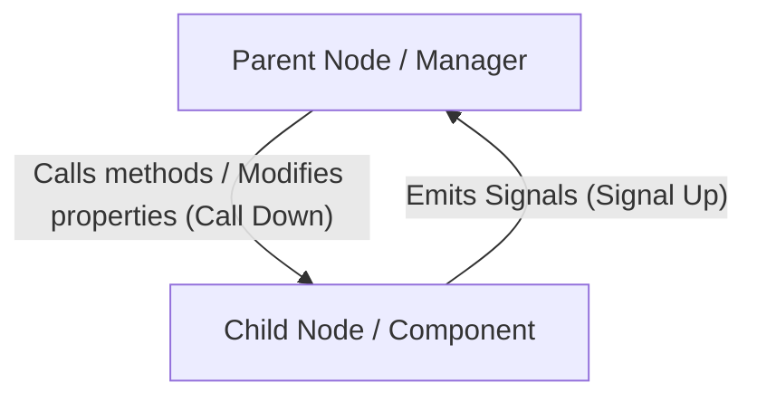

# Scenes, Nodes, SceneTree & Signals — Architectural Patterns

## Godot Mental Model

In Godot, an application is a dynamic tree of **Nodes** organized into **Scenes** (reusable sub-trees stored on disk as `.tscn`). Composition replaces rigid inheritance: entities are composed of specialized nodes (physics, collisions, sprites, audio, timers).

---

## 1. The Golden Rule: "Call Down, Signal Up"

To keep scenes modular, testable, and decoupled:



- **Parents call methods on children:** `health_bar.set_value(player_health)` or `weapon.fire()`.
- **Children never call `get_parent().method()`:** Instead, child nodes emit signals (`health_depleted.emit()`), and the parent connects and responds to those signals.

---

## 2. Complete Node Lifecycle

```text
1. _init()                -> In-memory instantiation (ResourceLoader or .new()).
2. _enter_tree()          -> The node just entered the SceneTree.
3. _ready()               -> All child nodes have run _ready() first (bottom-up order).
4. _process(delta)        -> Called every rendered graphics frame (variable delta).
5. _physics_process(delta)-> Called at fixed physics engine intervals (60 Hz by default).
6. _input(event)          -> Intercepts inputs before the UI.
7. _unhandled_input(event)-> Intercepts inputs not consumed by the UI (ideal for gameplay).
8. _exit_tree()           -> The node was removed from the tree (cleanup & deallocation).
```

> [!TIP]
> Use `_unhandled_input(event)` for player controls. This prevents characters from shooting or jumping when the player clicks on menus or interacts with UI buttons.

---

## 3. Node Access: `%SceneUniqueNodes` vs `@export`

Avoid brittle paths like `$Root/VBoxContainer/Panel/HealthBar`. Prefer:

### A. Scene Unique Nodes (`%`)
Mark the node in the editor as *"Access as Unique Name"*:
```gdscript
@onready var health_bar: ProgressBar = %HealthBar
@onready var score_label: Label = %ScoreLabel
```
*Advantage:* If you reorganize container hierarchies, the reference remains valid within that scene.

### B. Dependency Injection via `@export`
For external references or configurable sibling nodes:
```gdscript
@export var target_marker: Marker2D
@export var audio_player: AudioStreamPlayer2D
```

---

## 4. Signal Bus Pattern (Global Event Bus)

For communication between distant systems (e.g., an Enemy dies and the HUD updates the score without either knowing about the other):

1. Create an autoload script `Events.gd` (registered in `Project Settings > Autoloads`):
```gdscript
# Events.gd (Autoload Singleton)
extends Node

signal enemy_defeated(points: int, position: Vector2)
signal player_health_updated(current: int, maximum: int)
signal game_paused(is_paused: bool)
```

2. The emitter (e.g., `Enemy.gd`):
```gdscript
func _die() -> void:
    Events.enemy_defeated.emit(100, global_position)
    queue_free()
```

3. The receiver (e.g., `ScoreManager.gd` or `HUD.gd`):
```gdscript
func _ready() -> void:
    Events.enemy_defeated.connect(_on_enemy_defeated)

func _on_enemy_defeated(points: int, _pos: Vector2) -> void:
    current_score += points
    %ScoreLabel.text = "Score: %d" % current_score
```

---

## 5. Dynamic Instantiation & Safe Spawning

When spawning projectiles, enemies, or visual effects:

```gdscript
const BULLET_SCENE: PackedScene = preload("res://scenes/bullet.tscn")

func shoot() -> void:
    var bullet_instance := BULLET_SCENE.instantiate() as Node2D
    if not bullet_instance:
        return
    
    # Configure transform before adding to tree
    bullet_instance.global_position = %MuzzleMarker.global_position
    bullet_instance.rotation = global_rotation
    
    # Add to world (never to player if bullet must move independently)
    get_tree().current_scene.add_child(bullet_instance)
```

---

## 6. Scene Switching (Synchronous vs Asynchronous Background Loading)

### Simple Switch (Quick screens / Menus)
```gdscript
get_tree().change_scene_to_file("res://scenes/main_menu.tscn")
```

### Background Threaded Loading (Heavy Levels)
```gdscript
var scene_path := "res://scenes/level_01.tscn"

func start_loading() -> void:
    ResourceLoader.load_threaded_request(scene_path)

func _process(_delta: float) -> void:
    var progress: Array = []
    var status := ResourceLoader.load_threaded_get_status(scene_path, progress)
    
    if status == ResourceLoader.THREAD_LOAD_IN_PROGRESS:
        %LoadingBar.value = progress[0] * 100.0
    elif status == ResourceLoader.THREAD_LOAD_LOADED:
        var packed_scene := ResourceLoader.load_threaded_get(scene_path) as PackedScene
        get_tree().change_scene_to_packed(packed_scene)
```

---

## 7. Groups (Organization & Batch Execution)

Use groups for logical categorization:
- In Editor: *Node > Groups* tab.
- In Code:
  ```gdscript
  add_to_group("hazards")
  
  if area.is_in_group("player_hitbox"):
      apply_damage()
  
  # Call method on all nodes in a group
  get_tree().call_group("enemies", "alert_target", player_position)
  ```
