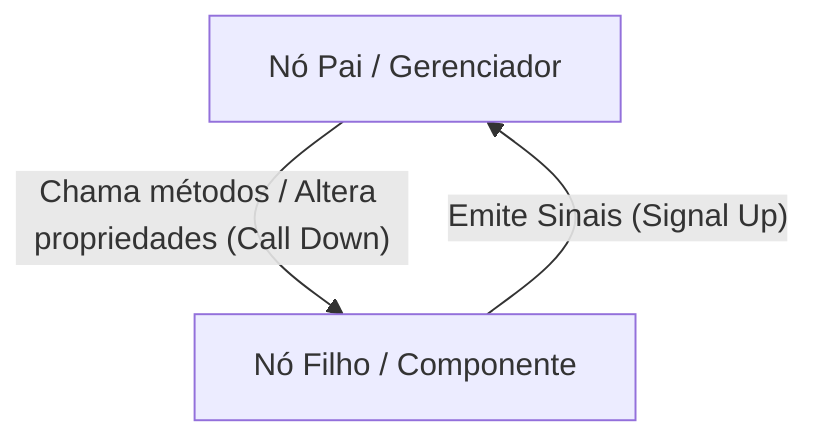

# Scenes, Nodes, SceneTree e Signals — Padrões Arquiteturais

## Modelo Mental do Godot

Em Godot, a aplicação é uma árvore dinâmica de **Nodes** agrupados em **Scenes** (árvores reutilizáveis salvas no disco como `.tscn`). A composição substitui a herança rígida: uma entidade é composta por nós especializados (física, colisão, sprite, áudio, timers).

---

## 1. A Regra de Ouro: "Call Down, Signal Up"

Para manter cenas modulares, testáveis e desacopladas:



- **Pais chamam métodos nos filhos:** `health_bar.set_value(player_health)` ou `weapon.fire()`.
- **Filhos nunca chamam `get_parent().metodo()`:** Em vez disso, o filho emite um sinal (`health_depleted.emit()`), e o pai conecta e reage a esse sinal.

---

## 2. Ciclo de Vida Completo do Node

```text
1. _init()                -> Instanciação em memória (ResourceLoader ou .new()).
2. _enter_tree()          -> O nó acabou de entrar na SceneTree.
3. _ready()               -> Todos os nós filhos executaram _ready() primeiro (ordem bottom-up).
4. _process(delta)        -> Chamado a cada frame gráfico renderizado (tempo variável).
5. _physics_process(delta)-> Chamado em intervalos fixos do motor de física (60 Hz por padrão).
6. _input(event)          -> Intercepta inputs antes da UI.
7. _unhandled_input(event)-> Intercepta inputs não consumidos pela UI (ideal para gameplay).
8. _exit_tree()           -> O nó foi removido da árvore (preparação para desalocação).
```

> [!TIP]
> Use `_unhandled_input(event)` para controles do jogador. Isso evita que o personagem atire ou pule enquanto o jogador clica em um botão de menu ou interage com a UI.

---

## 3. Acesso a Nós: `%SceneUniqueNodes` vs `@export`

Evite caminhos frágeis como `$Root/VBoxContainer/Panel/HealthBar`. Prefira:

### A. Scene Unique Nodes (`%`)
Marque o nó no editor como *"Access as Unique Name"*:
```gdscript
@onready var health_bar: ProgressBar = %HealthBar
@onready var score_label: Label = %ScoreLabel
```
*Vantagem:* Se a estrutura de contêineres mudar, o caminho continua válido dentro da mesma cena.

### B. Injeção via `@export`
Para referências externas ou nós irmãos configuráveis:
```gdscript
@export var target_marker: Marker2D
@export var audio_player: AudioStreamPlayer2D
```

---

## 4. Padrão Signal Bus (Event Bus Global)

Para comunicação entre sistemas distantes (ex.: o Inimigo morreu e a UI/HUD precisa atualizar o placar sem que um conheça o outro):

1. Crie um script de autoload `Events.gd` (registrado em `Project Settings > Autoloads`):
```gdscript
# Events.gd (Autoload Singleton)
extends Node

signal enemy_defeated(points: int, position: Vector2)
signal player_health_updated(current: int, maximum: int)
signal game_paused(is_paused: bool)
```

2. O emissor (ex.: `Enemy.gd`):
```gdscript
func _die() -> void:
    Events.enemy_defeated.emit(100, global_position)
    queue_free()
```

3. O receptor (ex.: `ScoreManager.gd` ou `HUD.gd`):
```gdscript
func _ready() -> void:
    Events.enemy_defeated.connect(_on_enemy_defeated)

func _on_enemy_defeated(points: int, _pos: Vector2) -> void:
    current_score += points
    %ScoreLabel.text = "Score: %d" % current_score
```

---

## 5. Instanciação Dinâmica e Spawning Seguro

Ao gerar projéteis, inimigos ou efeitos visuais:

```gdscript
const BULLET_SCENE: PackedScene = preload("res://scenes/bullet.tscn")

func shoot() -> void:
    var bullet_instance := BULLET_SCENE.instantiate() as Node2D
    if not bullet_instance:
        return
    
    # Configure antes de adicionar à árvore
    bullet_instance.global_position = %MuzzleMarker.global_position
    bullet_instance.rotation = global_rotation
    
    # Adicione ao mundo (nunca ao próprio player se o tiro deve ser independente)
    get_tree().current_scene.add_child(bullet_instance)
```

---

## 6. Troca de Cenas (Síncrona vs Assíncrona com Carregamento)

### Troca Simples (Telas Rápidas / Menus)
```gdscript
get_tree().change_scene_to_file("res://scenes/main_menu.tscn")
```

### Carregamento em Background (Fases Pesadas)
```gdscript
var scene_path := "res://scenes/level_01.tscn"

func start_loading() -> void:
    ResourceLoader.load_threaded_request(scene_path)

func _process(_delta: float) -> void:
    var progress: Array = []
    var status := ResourceLoader.load_threaded_get_status(scene_path, progress)
    
    if status == ResourceLoader.THREAD_LOAD_IN_PROGRESS:
        %LoadingBar.value = progress[0] * 100.0
    elif status == ResourceLoader.THREAD_LOAD_LOADED:
        var packed_scene := ResourceLoader.load_threaded_get(scene_path) as PackedScene
        get_tree().change_scene_to_packed(packed_scene)
```

---

## 7. Groups (Organização e Execução em Lote)

Use grupos para classificação lógica:
- No editor: aba *Node > Groups*.
- No código:
  ```gdscript
  add_to_group("hazards")
  
  if area.is_in_group("player_hitbox"):
      apply_damage()
  
  # Executa método em todos os nós do grupo
  get_tree().call_group("enemies", "alert_target", player_position)
  ```
